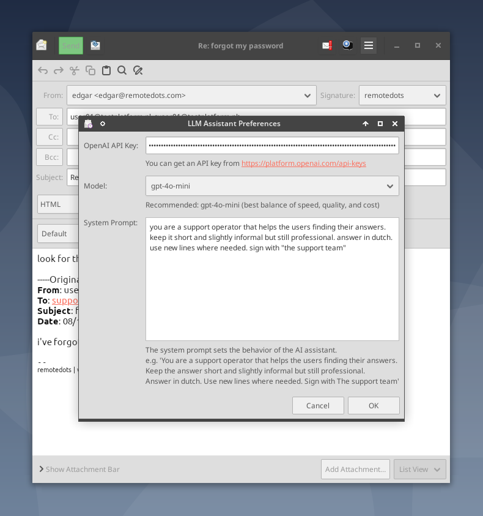
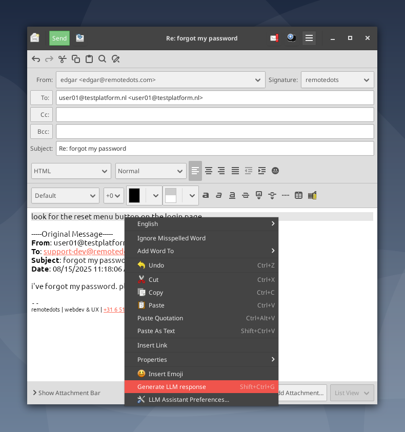

# Evolution LLM Assistant

A GNOME Evolution mail client module that integrates OpenAI's GPT models to help you write better emails faster.

> **Disclaimer**: This is a free-time project developed with Claude Code. Use at your own risk. This module sends data to OpenAI's API, which will incur costs based on your usage. The software is provided "as is" without warranty of any kind. See [License](#license) for full details.

## Features

- **AI-Powered Email Generation**: Select text and generate intelligent responses using GPT models
- **Keyboard Shortcut**: Quick access via `Ctrl+Shift+G`
- **Context Menu Integration**: Right-click selected text to generate responses
- **Model Selection**: Choose from all available GPT models (automatically fetched from OpenAI)
- **Customizable System Prompt**: Configure the AI's behavior and tone

## Screenshots


*Preferences dialog with model selection*


*Right-click menu integration*


*The result (showing that the output can be in another language as well)*

## Requirements

### Runtime Requirements
- GNOME Evolution mail client (3.x)
- Active internet connection
- OpenAI API key ([get one here](https://platform.openai.com/api-keys))

### Build Requirements (Debian/Ubuntu)
```bash
sudo apt-get install \
    evolution-dev \
    evolution-data-server-dev \
    libebook1.2-dev \
    libglib2.0-dev \
    libgtk-3-dev \
    libjson-glib-dev \
    libcurl4-openssl-dev \
    build-essential \
    pkg-config
```

### Build Requirements (Fedora/RHEL)
```bash
sudo dnf install \
    evolution-devel \
    evolution-data-server-devel \
    glib2-devel \
    gtk3-devel \
    json-glib-devel \
    libcurl-devel \
    gcc \
    make \
    pkgconfig
```

## Installation

### Option 1: User Installation

> **Note**: This option does **NOT** work on Evolution 3.56+ (Debian 13/Ubuntu 24.10+). Evolution only loads modules from `/usr/lib/evolution/modules/`. Use Option 2 instead.

```bash
# Clone the repository
git clone https://github.com/remotedots/evolution-llm-assistant.git
cd evolution-llm-assistant

# Build and install
make && make install-user

# Restart Evolution
evolution --force-shutdown && evolution &
```

The module will be installed to `~/.local/share/evolution/modules/`

### Option 2: System-Wide Installation (Required for Evolution 3.56+ under Debian 13)

Install for all users (requires sudo):

```bash
# Clone the repository
git clone https://github.com/remotedots/evolution-llm-assistant.git
cd evolution-llm-assistant

# Build and install
make && sudo make install

# Restart Evolution
evolution --force-shutdown && evolution &
```

The module will be installed to `/usr/lib/evolution/modules/`

> **Note**: The [GNOME Evolution Extensions wiki](https://wiki.gnome.org/Apps/Evolution/Extensions) states that user modules in `~/.local/share/evolution/modules` should be supported since Evolution 3.40.0. However, testing with Evolution 3.56.1 on Debian 13 (using `strace`) confirms that only `/usr/lib/evolution/modules/` is scanned. This appears to be either a Debian-specific build configuration or a regression in Evolution 3.56+.

## Configuration

On first run, a configuration file will be created at:
```
~/.config/evolution-llm-assistant/config.conf
```

### Quick Setup

1. **Get an OpenAI API Key**:
   - Visit [OpenAI API Keys](https://platform.openai.com/api-keys)
   - Create a new API key

2. **Configure the Module**:
   - Open Evolution and compose a new email
   - Right-click in the compose area
   - Select "LLM Assistant Preferences..."
   - Paste your API key
   - Select your preferred model (gpt-4o-mini recommended)
   - Customize the system prompt if desired
   - Click OK

### Configuration Options

| Option | Description | Default |
|--------|-------------|---------|
| `api_key` | Your OpenAI API key | (none) |
| `model` | GPT model to use | `gpt-4o-mini` |
| `system_prompt` | Instructions for the AI | "You are a helpful email writing assistant." |

### Example System Prompts

**Professional Support Team**:
```
You are a support operator that helps users find their answers.
Keep the answer short and slightly informal but still professional.
Answer in English. Use new lines where needed.
Sign with "The Support Team"
```

**Friendly Casual Tone**:
```
You are a helpful assistant that writes friendly, casual emails.
Use a warm tone and keep responses concise.
Sign off with "Best regards"
```

**Formal Business Communication**:
```
You are a professional business assistant.
Write formal, clear, and concise emails.
Maintain a professional tone at all times.
Sign with "Sincerely"
```

## Usage

### Generate Email Response

1. **Compose or Reply**: Open the email composer
2. **Select Text**: Highlight the text you want to respond to or use as context
3. **Generate**: Either:
   - Press `Ctrl+Shift+G`, OR
   - Right-click → "Generate LLM response"
4. **Wait**: The AI will process your request (typically 1-5 seconds)
5. **Review**: The generated response will replace your selection
6. **Edit**: Modify the response as needed before sending

### Tips for Best Results

- **Provide Context**: Select the original email text for better contextual responses
- **Be Specific**: The more context you provide, the better the AI can tailor the response
- **Edit Generated Text**: Always review and personalize AI-generated content
- **Use System Prompts**: Configure your system prompt to match your communication style

## Model Recommendations

| Model | Speed | Quality | Cost | Use Case |
|-------|-------|---------|------|----------|
| **gpt-4o-mini** | *** | *** | * | **Recommended** - Best balance |
| gpt-4o | ** | ***** | *** | Highest quality responses |
| gpt-4-turbo | *** | **** | ** | Fast with great quality |
| gpt-4 | * | **** | *** | High quality, slower |
| gpt-3.5-turbo | **** | ** | * | Fastest, most affordable |

## Troubleshooting

### Module Not Loading

```bash
# Check if module is installed
ls ~/.local/lib/evolution/modules/module-llm-assistant.so
# or for system-wide:
ls /usr/lib/evolution/modules/module-llm-assistant.so

# Check Evolution logs
evolution --force-shutdown
G_MESSAGES_DEBUG=all evolution 2>&1 | grep -i llm
```

### API Errors

- **"Failed to generate response"**: Check your internet connection and API key
- **Rate limit errors**: You've exceeded OpenAI's rate limits, wait a moment and try again
- **Invalid API key**: Verify your API key in preferences

### No Text Selected Warning

The "Generate LLM response" action requires text to be selected. Highlight some text before triggering the action.

### Models Not Loading

If the model dropdown is empty:
1. Check your API key is valid
2. Check your internet connection
3. The module will fallback to a hardcoded list of models

## Uninstallation

### User Installation
```bash
make uninstall-user
evolution --force-shutdown
```

### System-Wide Installation
```bash
sudo make uninstall
evolution --force-shutdown
```

To remove configuration:
```bash
rm -rf ~/.config/evolution-llm-assistant
```

## Development

### Building
```bash
make              # Build the module
make clean        # Clean build artifacts
make check-deps   # Verify all dependencies are installed
make help         # Show all available targets
```

### Project Structure
```
evolution-llm-module/
├── src/
│   ├── evolution-llm-extension.c    # Main extension logic
│   ├── evolution-llm-extension.h
│   ├── llm-preferences-dialog.c     # Preferences UI
│   ├── llm-preferences-dialog.h
│   ├── llm_client.c                 # OpenAI API client
│   └── llm_client.h
├── config/
│   ├── config.c                     # Configuration management
│   └── config.h
├── Makefile                         # Build system
└── README.md                        # This file
```

### Code Statistics
- Total lines of code: ~1,170
- Language: C
- Dependencies: GTK+3, Evolution 3.x, libcurl, json-glib

## Privacy & Security

- **API Key Storage**: Your OpenAI API key is stored in plaintext in `~/.config/evolution-llm-assistant/config.conf`. Ensure proper file permissions (600).
- **Data Transmission**: Selected text is sent to OpenAI's servers for processing. Do not use with sensitive or confidential information.
- **No Logging**: This module does not log email content locally.
- **Costs**: Using this module will incur charges from OpenAI based on the model and usage. Monitor your API usage at [OpenAI Platform](https://platform.openai.com/usage).

## Disclaimer & Warranty

**This software is provided "AS IS", without warranty of any kind, express or implied.**

This is a personal free-time project developed with assistance from Claude Code (Anthropic). By using this software, you acknowledge and agree that:

- **No Warranty**: There is no guarantee of functionality, reliability, or suitability for any purpose
- **Cost Responsibility**: You are solely responsible for all costs incurred through OpenAI API usage
- **Security**: You are responsible for securing your API keys and data
- **Data Privacy**: Any text sent to OpenAI is subject to their [Privacy Policy](https://openai.com/privacy/)
- **Support**: This is provided on a best-effort basis with no guaranteed support

**USE AT YOUR OWN RISK**

See the [MIT License](LICENSE) for complete legal terms.

## Contributing

Contributions are welcome! Please:

1. Fork the repository
2. Create a feature branch (`git checkout -b feature/amazing-feature`)
3. Commit your changes (`git commit -m 'Add amazing feature'`)
4. Push to the branch (`git push origin feature/amazing-feature`)
5. Open a Pull Request

## License

This project is licensed under the MIT License - see the [LICENSE](LICENSE) file for details.

## Acknowledgments

- Built for GNOME Evolution mail client
- Powered by OpenAI's GPT models
- Inspired by the need for better email productivity tools

## Support

- **Issues**: [GitHub Issues](https://github.com/remotedots/evolution-llm-assistant/issues)
- **Discussions**: [GitHub Discussions](https://github.com/remotedots/evolution-llm-assistant/discussions)

## Roadmap & Future Ideas

If this project gains traction, here are potential enhancements being considered:

### Security & Privacy
- **GNOME Keyring Integration**: Store API keys securely using libsecret instead of plaintext
- **Local LLM Support**: Add support for local models (Ollama, llama.cpp) for privacy-conscious users
- **Sensitive Content Detection**: Warn before sending potentially sensitive information to external APIs

### User Experience
- **Internationalization (i18n)**: Translate the UI to multiple languages (GTK+ gettext support)
- **Response Templates**: Save and reuse common response patterns
- **Token Counter**: Show estimated cost before generating response

### AI Features
- **Regenerate Response**: Try again with different parameters
- **Smart Reply Suggestions**: Multiple response options to choose from

### Technical Enhancements
- **Usage Statistics**: Track API usage and costs
- **Plugin Architecture**: Support for other AI providers (Anthropic Claude, Google Gemini, etc.)
- **Distribution Packages**: Official .deb, .rpm, Flatpak, and AUR packages

### Accessibility
- **Screen Reader Support**: Full accessibility compliance
- **Keyboard Navigation**: Complete keyboard-only workflow

---

**Want to contribute?** Check out our [Contributing Guidelines](#contributing) and pick an item from this roadmap!

**Have an idea?** Open a [GitHub Discussion](https://github.com/remotedots/evolution-llm-assistant/discussions) to propose new features!

## Changelog

### v1.0.0 (2025-10-01)
- Initial release
- Text selection-based generation
- Context menu integration
- Dynamic model fetching
- Comprehensive preferences dialog
- System prompt customization
- Keyboard shortcut support (Ctrl+Shift+G)
